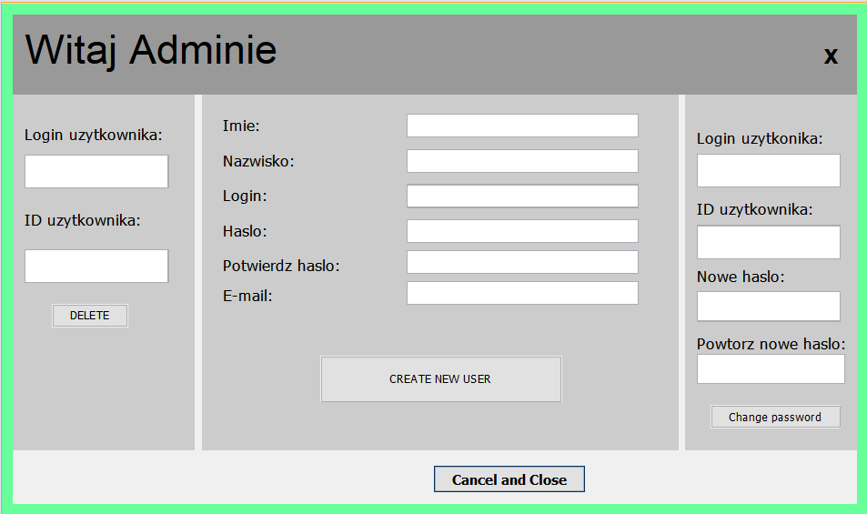
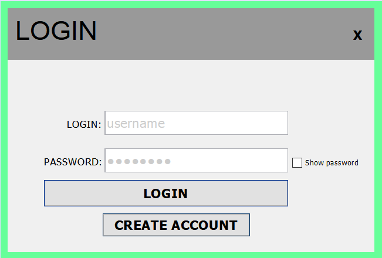
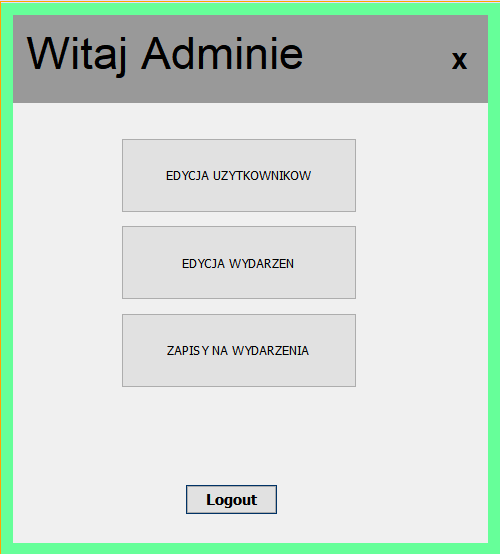
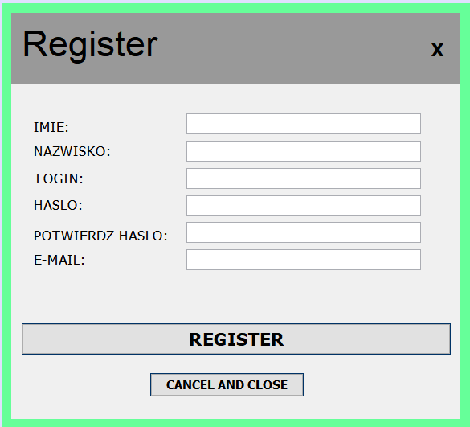
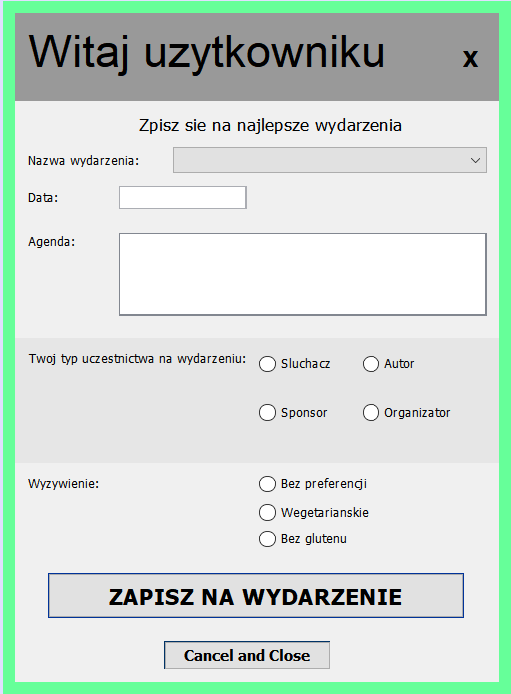

# EventManager
 
Event management application.

# Table of Contens
* [General info](#general-info)
* [Technologies](#technologies)
* [Features](#features)

## General info

Create new events, manage them, and control your users by editing them, creating them, and accepting their requests to join. All this using an administrator account. As a user, sign up for a specific event and see if your join request has been approved.

All this will be possible when logging into the appropriate account.

 

## Technologies
Java and MySql

## Features

A few of the things you can do with EventManager:
- create events
- deleted event
- edit the schedule and date of the event
- add a new user
- change user password or delete user
- accept and decline requests to join events
- register as a new user
- send requests to join the events and check their status

  
 

